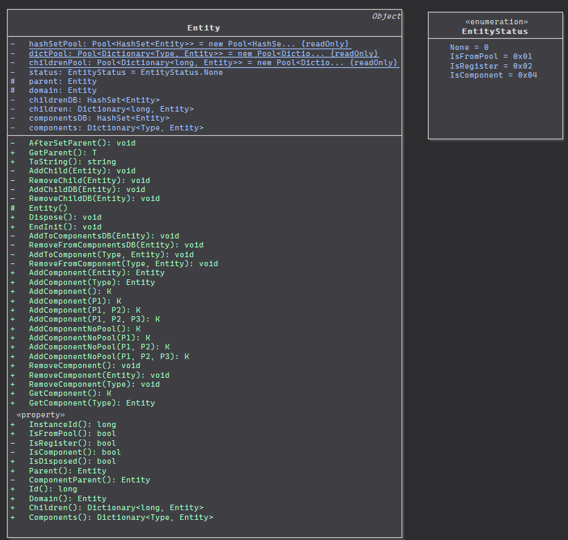

# Entity



`public partial class Entity : Object, IDisposable`


```csharp
public abstract class Object: ISupportInitialize
{
  public virtual void BeginInit(){}
  public virtual void EndInit(){}
}
```

## 会序列化到数据库的字段

```csharp
/// <summary>
/// BsonId
/// 实体下的组件通过AddComponent添加时,此Id会设置和Entity相同
/// </summary>
[BsonIgnoreIfDefault]
[BsonDefaultValue(0L)]
[BsonElement]
[BsonId]
public long Id { get; set; }

/// <summary>
/// 序列化实体集合
/// 需要存放到数据库中
/// </summary>
[BsonElement("Children")]
[BsonIgnoreIfNull]
private HashSet<Entity> childrenDB;

/// <summary>
/// 序列化组件(实体)集合
/// 需要存放到数据库中
/// 数据库中字段名为C  代表 Component
/// </summary>
[BsonElement("C")]
[BsonIgnoreIfNull]
private HashSet<Entity> componentsDB;
```

## 公开成员

### Id

```csharp
/// <summary>
/// BsonId
/// 实体下的组件通过AddComponent添加时,此Id会设置和Entity相同
/// </summary>
[BsonIgnoreIfDefault]
[BsonDefaultValue(0L)]
[BsonElement]
[BsonId]
public long Id { get; set; }
```


### InstanceId

```csharp
// 不需要序列化的属性上加[BsonIgnore]标签
/// <summary>
/// Entity 的 InstanceId
/// </summary>
[BsonIgnore]
public long InstanceId { get; set; }
```

InstanceId的生成规则:

```csharp
time = (DateTime.UtcNow.Ticks - epoch) / 10000000;

Head = AppId << 50;

InstanceId = Head + (time << 18) + ++value;
```

>【群主】熊猫(80081771) 15:57:26
InstanceId都不一样，Id又没限制不一样，Id是自己设置的.

中国有很多城市（`进程`），城市中有很多人（`Entity`）居住，每个人都有身份证号码（`Entity.Id`）。一个人每到一个市都需要办理居住证，分配到唯一的居住证号码（`InstanceId`），居住证号码的格式是`市编号+时间+递增`。身份证号码是永远不会变化的，但是居住证号码每到一个城市都变化的。


### IsFromPool


```csharp
/// <summary>
/// 是否从池中获取,
/// IsRegister = IsFromPool;
/// </summary>
[BsonIgnore]
public bool IsFromPool
{
  get
  {
    return (this.status & EntityStatus.IsFromPool) == EntityStatus.IsFromPool;
  }
  set
  {
    ...
    // 会一并设置IsRegister
    this.IsRegister = value;
  }
}
```

这里会用到私有成员`IsRegister`

```csharp
/// <summary>
/// 此Entity是否注册到EventSystem中,
/// 私有属性不允许外部设置,
/// 只在两个地方调用set:
/// 1. IsFromPool属性的set
/// 2. Domain属性的set, 并且触发所有children的Domain的set
/// </summary>
[BsonIgnore]
private bool IsRegister
{
  get
  {
    return (this.status & EntityStatus.IsRegister) == EntityStatus.IsRegister;
  }
  set
  {
    ...

    // 是否注册到EventSystem中,
    // false 则EventSystem.Remove(Entity.InstanceId)
    // true  则添加到EventSystem
    Game.EventSystem.RegisterSystem(this, value);
  }
}
```

### Parent

```csharp
/// <summary>
/// 父实体
/// </summary>
[BsonIgnore]
public Entity Parent
{
  get
  {
    return this.parent;
  }
  set
  {
    ...

    if (this.parent != null) // 之前有parent
    {
      // parent相同，不设置
      if (this.parent.InstanceId == value.InstanceId)
      {
        ...
        return;
      }
      // 之前parent不相同, 从之前的移除
      this.parent.RemoveChild(this);
      // 新赋值parent,并将此添加为child
      this.parent = value;
      this.parent.AddChild(this);
      // 并设置Doamin与父实体相同
      this.Domain = this.parent.domain;
    }
    else
    {
      this.parent = value;
      this.parent.AddChild(this);

      this.IsComponent = false;
      // 检测自己的domain是不是跟父亲一样
      AfterSetParent();
    }
  }
}
```

### Domain

```csharp
/// <summary>
/// domain就是指这个entity属于哪个scene
/// </summary>
[BsonIgnore]
protected Entity domain;

/// <summary>
/// children的域都与parent相同
/// domain还有个很重要的作用，
/// 就是设置domain的时候才会执行反序列化system，
/// 还有注册eventsystem
/// </summary>
/// <exception cref="Exception"></exception>
[BsonIgnore]
public Entity Domain
{
  get
  {
    return this.domain;
  }
  set
  {
    if (value == null)
    {
      return;
    }
    // 保存先前的domain
    Entity preDomain = this.domain;
    this.domain = value;

    // value 不是 Scene会抛异常
    if (!(this.domain is Scene))
    {
      throw new Exception($"domain is not scene: {this.GetType().Name}");
    }

    this.domain = value;

    // 是否注册到EventSystem,跟parent一致
    if (this.parent != null)
    {
      this.IsRegister = this.Parent.IsRegister;
    }

    // 递归设置孩子的Domain
    if (this.children != null)
    {
      foreach (Entity entity in this.children.Values)
      {
        entity.Domain = this.domain;
      }
    }
    // 递归设置子组件的Domain
    if (this.components != null)
    {
      foreach (Entity component in this.components.Values)
      {
        component.Domain = this.domain;
      }
    }
    // 原本domain为null,并且不是从池中获取的Entity
    // 因为数据库或者消息经常需要执行这个system来还原成序列化之前的样子
    if (preDomain == null && !this.IsFromPool)
    {
      // 跑这个Entity的DeserializeSystem
      Game.EventSystem.Deserialize(this);
    }
  }
}
```

### Children

```csharp
[BsonIgnore]
private Dictionary<long, Entity> children;

/// <summary>
/// 字典: Entity.Id(存是BsonId) , Entity
/// </summary>
[BsonIgnore]
public Dictionary<long, Entity> Children
{
  get
  {
    if (this.children == null)
    {
      this.children = childrenPool.Fetch();
    }

    return this.children;
  }
}
```

### Components

```csharp
[BsonIgnore]
private Dictionary<Type, Entity> components;

[BsonIgnore]
public Dictionary<Type, Entity> Components
{
  get
  {
    return this.components; // 感觉少了一个null判断和Fetch? mark!
  }
}
```

### IsDisposed

```csharp
/// <summary>
/// Entity.InstanceId == 0 ?
/// </summary>
[BsonIgnore]
public bool IsDisposed
{
  get
  {
    return this.InstanceId == 0;
  }
}
```


# 总结一下

## 创建Entity 和 Scene


```csharp
protected Entity()
{
  this.InstanceId = IdGenerater.GenerateId();
}
```

1. `EntityFactory`
  - `CreateWithParent(Type type, Entity parent)`

```csharp
    obj.IsFromPool    = true/false;
    obj.IsRegister    = IsFromPool;
    component.Domain  = parent.Domain;
    component.Id      = component.InstanceId;
    component.Parent  = parent;
```

  - `Create(Entity domain, Type type)`

```csharp
    obj.IsFromPool    = true/false;
    obj.IsRegister    = IsFromPool;
    component.Domain  = domain ?? component;
    component.Id      = component.InstanceId;
```
  - `CreateWithId<T>(Entity domain, long id)`

```csharp
    obj.IsFromPool    = true/false;
    obj.IsRegister    = IsFromPool;
    component.Domain  = domain ?? component;
    component.Id      = id;
```
  - `CreateScene(long id, string name, SceneType sceneType, Scene parent = null)`

```csharp
    obj.IsFromPool    = true/false;
    obj.IsRegister    = IsFromPool;
    scene.Id          = id;
    scene.InstanceId  = IdGenerater.GenerateSceneInstanceId(id);
    scene.Parent      = parent;
    scene.Domain      = scene;
    scene.Name        = name;
    scene.SceneType   = sceneType;
```


2. 用`Entity`自带的方法
  - `CreateWithComponentParent`
    - 判断是否有这个特性`type.IsDefined(typeof (NoObjectPool)`
    - 判断参数`isFromPool`
```csharp
    obj.IsFromPool    = true/false;
    obj.IsRegister    = IsFromPool;
    component.Domain  = parent.Domain;
    component.Id      = component.InstanceId;
    component.Parent  = parent;
```
