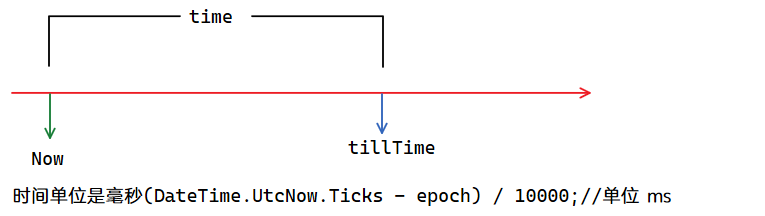
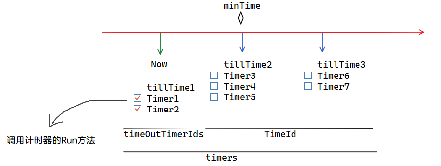

# 计时器




## 简单结构示意

```csharp
/// <summary>
/// 存放的  Entity.Id, OnceWaitTimer
/// 管理计时器的ID和实现了ITimer接口(Run方法)的计时器
/// </summary>
private readonly Dictionary<long, ITimer> timers = new Dictionary<long, ITimer>();

/// <summary>
/// MultiMap key: time, value: timer id
/// 某个时间点 的计时器列表.
/// MultiMap: 存储了一个是以键排序的字典  dictionary : [T, List K]
/// </summary>
public readonly MultiMap<long, long> TimeId = new MultiMap<long, long>();

/// <summary>
/// 超时的计时器Id队列集合
/// </summary>
private readonly Queue<long> timeOutTimerIds = new Queue<long>();

/// <summary>
/// 记录最小时间，不用每次都去MultiMap取第一个值,
/// </summary>
private long minTime;
```



# 三种计时器

`TimerComponent`提供了3种计时器:
1. `OnceWaitTimer`
2. `OnceTimer`
3. `RepeatedTimer`


## OnceWaitTimer

主要用于:
- **运行1次的延时计时器, 可以取消,取消后会从`timers`移除这个计时器. 任务完成后返回`ETTask.CompletedTask`.**
- `public ETTask WaitTillAsync(long tillTime, ETCancellationToken cancellationToken)`
  - 延时到指定时间, 传入可取消标记
- `public ETTask WaitTillAsync(long tillTime)`
  - 延时到指定时间, 不可取消.
- `public ETTask WaitAsync(long time, ETCancellationToken cancellationToken)`
  - 延时一段时间, 传入可取消标记
- `public ETTask WaitAsync(long time)`
  - 延时一段时间, 不可取消.


`await timerComponent.WaitAsync(50, cancellationToken);`

返回的是`ETTaskCompletionSource`创建的`ETTask`.  

> TaskCompletionSource [表示未绑定到委托的 Task<TResult> 的制造者方，并通过 Task 属性提供对使用者方的访问]

> Task的调度由TaskCompletionSource(任务基础结构)控制

> 通过构造一个TaskCompletionSource<TResult>(任务基础结构)对象创建一个Task，该Task在创建时也处于WaitingForActivation状态。这个状态意味着该Task的调度由任务基础结构控制。


例子:

```csharp
// 开启协程移动,每100毫秒移动一次，并且协程取消的时候会计算玩家真实移动
// 比方说玩家移动了2500毫秒,玩家有新的目标,这时旧的移动协程结束,将计算250毫秒移动的位置，而不是300毫秒移动的位置
public async ETTask StartMove(ETCancellationToken cancellationToken)
{
    Unit unit = this.GetParent<Unit>();
    this.StartPos = unit.Position;
    this.StartTime = TimeHelper.Now();
    float distance = (this.Target - this.StartPos).magnitude;
    if (Math.Abs(distance) < 0.1f)
    {
        return;
    }

    this.needTime = (long)(distance / this.Speed * 1000);

    TimerComponent timerComponent = Game.Scene.GetComponent<TimerComponent>();

    // 协程如果取消，将算出玩家的真实位置，赋值给玩家
    cancellationToken.Register(() =>
    {
        long timeNow = TimeHelper.Now();
        if (timeNow - this.StartTime >= this.needTime)
        {
            unit.Position = this.Target;
        }
        else
        {
            float amount = (timeNow - this.StartTime) * 1f / this.needTime;
            unit.Position = Vector3.Lerp(this.StartPos, this.Target, amount);
        }
    });

    while (true)
    {
        await timerComponent.WaitAsync(50, cancellationToken);

        long timeNow = TimeHelper.Now();

        if (timeNow - this.StartTime >= this.needTime)
        {
            unit.Position = this.Target;
            break;
        }

        float amount = (timeNow - this.StartTime) * 1f / this.needTime;
        unit.Position = Vector3.Lerp(this.StartPos, this.Target, amount);
    }
}
```

## OnceTimer

常用于:
- **创建运行1次的计时器,并且完成时执行一个`action`**
- `public long NewOnceTimer(long tillTime, Action action)`
  - 创建运行1次的计时器

## RepeatedTimer
常用于:
- **创建运行无数次的计时器,并且每次完成后执行一个`action`, 返回的是这个计时器的Id**
- `public long NewRepeatedTimer(long time, Action action)`
  - 创建重复计时器
- `public RepeatedTimer GetRepeatedTimer(long id)`
  - 热更后需要调用此方法重新设置action.

```csharp
/// <summary>
/// 重复进行的计时器, 第一个计时器完成后,会自动添加下一个计时器.
/// 下一个计时器的tillTime = StartTime + RepeatedTime * Count;
/// </summary>
public class RepeatedTimer: Entity, ITimer
{
  public void Awake(long repeatedTime, Action callback)
  {
    this.StartTime = TimeHelper.Now();
    this.RepeatedTime = repeatedTime;
    this.Callback = callback;
    this.Count = 1;
  }
  private long StartTime { get; set; }
  private long RepeatedTime { get; set; }
  // 下次一是第几次触发
  private int Count { get; set; }
  public Action Callback { private get; set; }

  public void Run()
  {
    ++this.Count;
    TimerComponent timerComponent = this.GetParent<TimerComponent>();
    long tillTime = this.StartTime + this.RepeatedTime * this.Count;
    timerComponent.AddToTimeId(tillTime, this.Id);

    try
    {
      this.Callback.Invoke();
    }
    catch (Exception e)
    {
      Log.Error(e);
    }
  }

  public override void Dispose()
  {
    if (this.IsDisposed)
    {
      return;
    }

    long id = this.Id;

    if (id == 0)
    {
      Log.Error($"RepeatedTimer可能多次释放了");
      return;
    }

    base.Dispose();

    this.StartTime = 0;
    this.RepeatedTime = 0;
    this.Callback = null;
    this.Count = 0;
  }
}
```


停止这个计时器的方法:
```csharp
// 保存创建时返回的重复计时器的Id
long RepeatedTimer = TimerComponent.Instance.NewRepeatedTimer(checkInteral, self.Check);

// Destroy时移除
TimerComponent.Instance.Remove(self.RepeatedTimer);
```

**用于热更Load之后,重新设置action.**

```csharp
/// <summary>
/// 用于热更Load之后,重新设置action的方法
/// </summary>
/// <param name="id"></param>
/// <returns></returns>
public RepeatedTimer GetRepeatedTimer(long id)
{
  if (!this.timers.TryGetValue(id, out ITimer timer))
  {
    return null;
  }
  return timer as RepeatedTimer;
}
```

例如:

```csharp
[ObjectSystem]
public class SessionIdleCheckerComponentLoadSystem : LoadSystem<SessionIdleCheckerComponent>
{
    public override void Load(SessionIdleCheckerComponent self)
    {
        RepeatedTimer repeatedTimer = TimerComponent.Instance.GetRepeatedTimer(self.RepeatedTimer);
        if (repeatedTimer != null)
        {
            repeatedTimer.Callback = self.Check;
        }
    }
}
```


# 群内讨论相关
```java
【码仙】初见
问下、大家做任务都是怎么设计的？比如一周可以执行一次，一天可以执行两次这样的？
【码神】无名
@初见
可以用体力，体力完了就不能进行任务了
【码神】无名
当然可以花钱买体力
【码仙】初见
这个任务链我知道怎么设计，就是这个任务时间总感觉我设计的不对
【码神】冒牌熊猫
每天12点更新？每周一12点更新？
【码神】冒牌熊猫
那个scut框架，就设计了这个，每天几点去执行一些事情.....
【码农】kss
scut不行
【码神】冒牌熊猫
比如每天12点，更新奖励，可以调那个接口。
【码神】渐渐
这个可以自己写的
【码神】渐渐
timercomponent就是等到某时间戳再执行的方法
【码仙】Che8376
定时器？
【码神】冒牌熊猫
难道每次执行了1次，就加一个24小时的秒数。。
【码神】渐渐
对，不用加秒数，可以直接给定时间戳，等到那个时间到了就触发
【码神】渐渐
注意世界标准时间，不要用北京时间
【码神】渐渐
@牛肉干 就是你说的，每次执行完，再给下一天的时间戳，这样TimerComponent队列里面永远只存在一个计时，就能实现每天
【码仙】初见
我感觉你们说的好像是定时执行服务器的任务了
【码农】kss
加个任务服
【码农】kss
然后跨线程和主程通讯
【码农】kss
定时通讯一次嘛
【码仙】哲学绅士
服务器肯定得写个整点定时器
【码仙】哲学绅士
整点的时候发事件，然后有需要的注册一下就行了
【码仙】哲学绅士
而且这个整点定时器更新时间得存数据库，避免服务器停服期间的整点发放活动没触发
【码仙】哲学绅士
在服务器启动的时候要发送过了多少个整点事件
【群主】熊猫(80081771)
就用timercomponet写啊，1点到了wait2点，2点到了wait3点
【码仙】哲学绅士
嗯
【码仙】哲学绅士
就是基于timercomponent写的
【群主】熊猫(80081771)
几行代码的事，框架还要封装这个？
-------------------------------------

【码仙】Flamesky
猫大，，之前timercomponent在unity上，会跟unity的计时有小偏差，，一两百秒就差别1s左右，，不知道新的还有没有这个问题
【群主】熊猫(80081771)
@Flamesky ET用的是时间戳，是绝对时间，你用unity是不是去累加了
【码仙】哲学绅士
unity哪个计时？
【码仙】Flamesky
一帧帧累加会造成很大偏差？
【码仙】Flamesky
回头我用timercomponent分别在unity跟server同步计时对比看看
【群主】熊猫(80081771)
@Flamesky 会的，最好用绝对时间，不要累加
【码农】天龙俊熙
会的，写这个用时间戳才是正道
【码农】天龙俊熙
帧累加只合适那些以秒计量生效的事件

```
