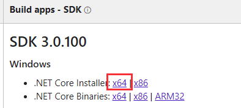

# For-ET-Record-Book

**基于ET6.0**

[4.0-5.0的相关](https://bbs.honorworkroom.com/forum.php?mod=viewthread&tid=210&extra=page%3D1)

# ET

> 熊猫:从不考虑收费，et开源的目标是推动前后端全部使用c#做游戏。

[[Github]](https://github.com/egametang/ET)
[[ET论坛]](https://bbs.honorworkroom.com/forum.php)

ET是一个开源的游戏客户端（基于unity3d）服务端双端框架，服务端是使用C# .net core开发的分布式游戏服务端.

- [[ETBook] 为什么使用C# .net core做服务端？](https://github.com/egametang/ET/blob/master/Book/1.2%E4%B8%BA%E4%BB%80%E4%B9%88%E4%BD%BF%E7%94%A8.net%20core.md)
  - ET框架使用C#做服务端，现在C#是完全可以跨平台的，在linux上安装.netcore，即可，不需要修改任何代码，就能跑起来。性能方面，现在.netcore的性能非常强，比lua，python，js什么快的多了。做游戏服务端完全不在话下。
- **为什么选择ILRuntime热更?**
  - 这世界上没有ios上不能用的热更方案，因为除了ios以外根本不需要任何热更方案就能直接热更
  - 因为ios的限制，之前unity热更新一般使用lua，导致unity3d开发人员要写两种代码，麻烦的要死。之后幸好出了ILRuntime库，利用ILRuntime库，unity3d可以利用C#语言加载热更新dll进行热更新。ILRuntime一个缺陷就是开发时候不支持VS debug，这有点不爽。ET框架使用了一个预编译指令ILRuntime，可以无缝切换。平常开发的时候不使用ILRuntime，而是使用Assembly.Load加载热更新动态库，这样可以方便用VS单步调试。在发布的时候，定义预编译指令ILRuntime就可以无缝切换成使用ILRuntime加载热更新动态库。这样开发起来及其方便，再也不用使用狗屎lua了
- [[ETBook] 为什么后端选MongoBson序列化库?](https://github.com/egametang/ET/blob/master/Book/3.2%E5%BC%BA%E5%A4%A7%E7%9A%84MongoBson%E5%BA%93.md)
- [[ETBook] 为什么选MongoDB数据库?](https://bbs.honorworkroom.com/forum.php?mod=viewthread&tid=183&extra=page%3D1)
- [[ETBook] 什么是组件式设计?](https://github.com/egametang/ET/blob/master/Book/3.3%E4%B8%80%E5%88%87%E7%9A%86%E7%BB%84%E4%BB%B6.md)
  - ET在设计的时候吸收了这些想法，但是并不完全照搬，目前的设计是我经过长期的思考跟重构得来的，还是有些自己特色。
- [[猫大语录] 为什么在ET4.0之后不附带帧同步Demo?](https://bbs.honorworkroom.com/forum.php?mod=viewthread&tid=211&highlight=%E7%8A%B6%E6%80%81%E5%90%8C%E6%AD%A5)
- [[猫大语录] 为什么在ET4.0之后服务器命令行没有log?](https://bbs.honorworkroom.com/forum.php?mod=viewthread&tid=151&highlight=repl)

# 运行Demo前的准备

1. IDE
  - **Rider**
    - 安装 [.net core 3.0.100](https://dotnet.microsoft.com/download/dotnet-core/3.0)

2. Unity版本选择
  - **ET6.0(master)**

  - [x] unity 2018.4.10f1
  - [x] unity 2018.4.11f1

>别问怎么破解.问就是个人免费版.如果只是为了黑色皮肤, 使用这个插件去改 [[UnityDarkSkin]](https://github.com/Gluschenko/UnityDarkSkin)
3. 安装MongoDB数据库

# 准备运行Demo

- [运行指南](https://github.com/egametang/ET/blob/master/Book/1.1%E8%BF%90%E8%A1%8C%E6%8C%87%E5%8D%97.md)

- [ET5.0之前常见的错误解决方法](https://bbs.honorworkroom.com/forum.php?mod=viewthread&tid=203&extra=page%3D1)
  - 运行环境net CDK不匹配问题
  - 运行环境问题
  - Unity DLL引用错误问题
  - 打包EXE运行黑屏问题
  - ILRuntime一些问题
  - 服务端部署在云服务器问题
  - 打包IL2CPP问题
  - Android9 HTTP问题无法使用UnityWebRequest的问题
  - Reference Collector脚本无法修改key值
  - Win32Exception找不到指定文件,WIN10文件权限
  - KCP.android.ARM64问题
- [ET6.0问题收集](https://bbs.honorworkroom.com/forum.php?mod=viewthread&tid=239&page=1&extra=#pid645)
  - 启动服务器命令行参数错误

# 学习ET

你可能需要如下知识储备:
- [C#语言基础 (CLR Via C#)](/Base/CSharpBase.md)
- 设计模式
- [数据结构](/Base/DataStructure.md)
- 了解ECS
- 了解actor模型
  - [十分钟带你了解Actor模型](https://www.brianstorti.com/the-actor-model/)
- 网络层TCP/UDP/KCP/ENET
- MongoDB数据库
- MongoBson序列化库
- Protobuf
- 服务器分布式相关
- [网络同步模型的认识](https://www.gameres.com/849046.html?tdsourcetag=s_pcqq_aiomsg)

客户端
- Unity基础
- UGUI
- AssetBundle流程
- ILRuntime

其余
- ~~AstarPathfinding~~
> ET的寻路Unity2019有问题，可以用这个寻路替代，这个寻路非常简单，很实用
https://github.com/genechiu/NavMesh
我现在改成用recastnavigation寻路了，c#包cpp，前后端都这样用,astar那个不支持2019要重新移植，太麻烦了. et6是不会上recast了，实在是没时间弄

- ~~Behavior Designer~~
- ~~FGUI~~
- NLog
- Repl

>猫大语录:
应该先去提高下c#基础跟编程基础，再来看ET，碰到问题自己想办法解决，谷歌，打log。你现在好比初中基础却来做大学题目一样，到处碰壁，碰到问题自己不研究指望别人给你找问题，这样编程技术是无法提高的.
群里能力有高有低，问问题也没什么。但是我是希望群里提问题前能够经过自己一番摸索，经过自己思考，经过谷歌，经过调试log等等再问。很多问题经过自己摸索查找资料能够增长很多知识。其实程序开发就是在不断找bug，在找bug中提升自己。

# 简单的说说ET6的设计。

1. 之前每个功能是一个进程，比如realm gate location map，现在改成每个功能是一个Scene，一个Scene可以放到一个进程中。这样一台物理机先启动固定的进程，然后各个scene放到进程中运行。非常类似docker。
2. 所有的Scene放在一个进程就变成了AllServer模式
3. 服务器内部全部使用actor发送消息，比如realm发给gate，其实是发个actor消息到gate scene
4. dbserver将取消，每个进程直连mongodb，使用异步调用存取数据
5.协程锁简化了很多实现，例如location队列，actor队列，mailbox消息队列，全部使用协程锁实现，代码非常精简。
6. Scene可以开服前配置好在哪个进程（比如realm gate）也可以动态创建（比如副本，分线场景）。动态创建Scene回收Scene非常简单。

# 群友提供的教程&工具(6.0相关)

- [swicksu/ET-Assistant](https://github.com/swicksu/ET-Assistant)  by 零基础 - 苏伟涛
  - [相关用法的B站教学视频](https://space.bilibili.com/72371081?spm_id_from=333.788.b_765f7570696e666f.2)
- [烟雨迷离半世殇的ET6.0教程](https://space.bilibili.com/33595745)
- [ET & Addressable C# 热更方案分享](http://www.liuocean.com/index.php/2019/11/19/et-addressable-c-re-geng-fang-an-fen-xiang/#Addressable-3)
